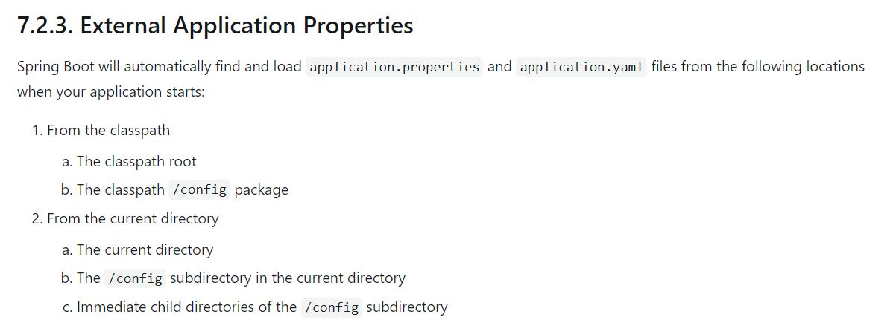

# 2.5.13版本的官方文档：
https://docs.spring.io/spring-boot/docs/2.5.13/reference/htmlsingle/#features.external-config.files

 1.a file:./
 1.a file:./config
 2.a classpath:/
 2.b classpath:/config/
 2.c classpath:/config/?/

# 自动配置原理
官方文档地址：https://docs.spring.io/spring-boot/docs/2.5.13/reference/htmlsingle/#appendix.application-properties
1、SpringBoot启动会加载大量的自动配置类

2、我们看我们需要的功能有没有在SpringBoot默认写好的自动配置类当中；

3、我们再来看这个自动配置类中到底配置了哪些组件；（只要我们要用的组件存在在其中，我们就不需要再手动配置了）

4、给容器中自动配置类添加组件的时候，会从properties类中获取某些属性。我们只需要在配置文件中指定这些属性的值即可；

xxxxAutoConfigurartion：自动配置类；给容器中添加组件

xxxxProperties:封装配置文件中相关属性；

